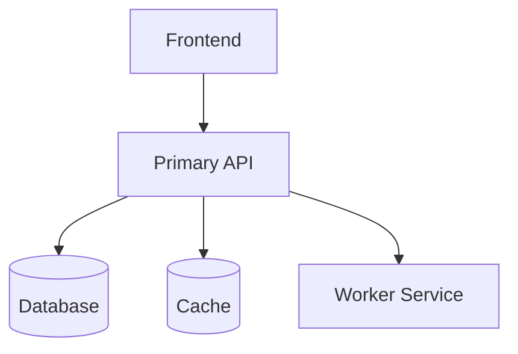

# Architecture

<!-- SETUP INSTRUCTIONS
Replace this file with the actual system architecture for your project.
Populate each section before starting development. Update whenever structural
changes are made — the documentation-sync rule requires this.
-->

## System Overview

<!-- Describe the system in 2-3 sentences. What does it do? Who uses it? -->

[TODO: High-level system description]

## Component Diagram

<!-- Insert an ASCII diagram, Mermaid block, or link to an external diagram tool.
Example Mermaid block:

-->

[TODO: Component diagram]

## Service Map

| Service | Language / Framework | Directory | Responsibility |
|---------|---------------------|-----------|----------------|
| Primary API | [from config.json] | `./backend` | [TODO] |
| Worker Service | [from config.json] | `./workers` | [TODO] |
| Frontend | [from config.json] | `./web` | [TODO] |

## Data Flow

<!-- Describe how data moves through the system for the primary use case. -->

[TODO: Primary data flow description]

## Infrastructure

| Resource | Provider | Purpose |
|----------|---------|---------|
| [TODO] | [from config.json] | [TODO] |

## Third-Party Integrations

| Service | Purpose | Auth Method |
|---------|---------|-------------|
| [TODO] | [TODO] | [TODO] |

## Key Design Decisions

<!-- Document non-obvious choices and the reasoning behind them. -->

[TODO: List key design decisions]

---

## Version History

<!-- Append an entry here for every significant architectural pivot. -->

| Date | Change | Reason |
|------|--------|--------|
| [TODO: project start date] | Initial architecture | [TODO] |
